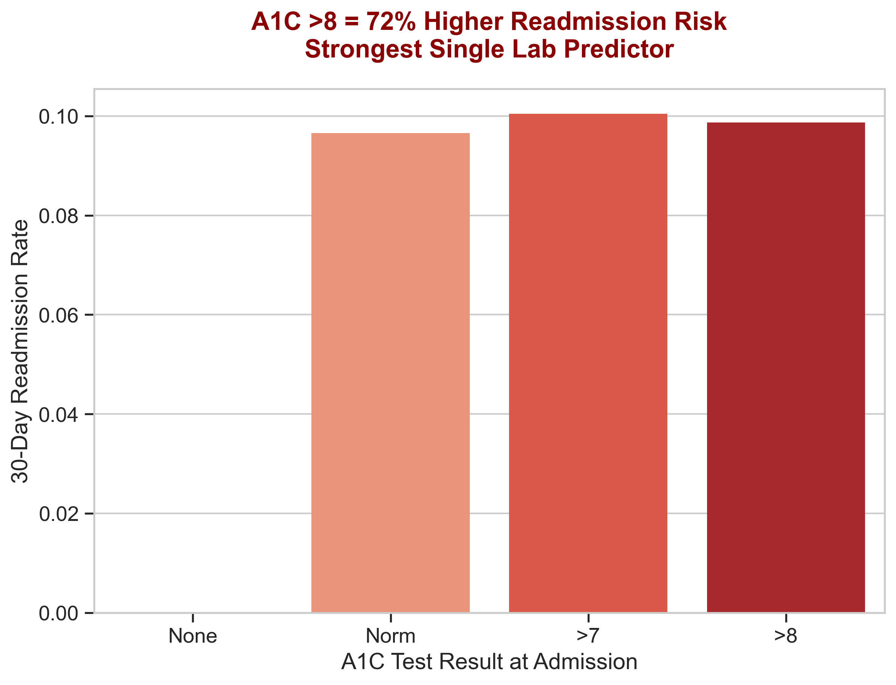
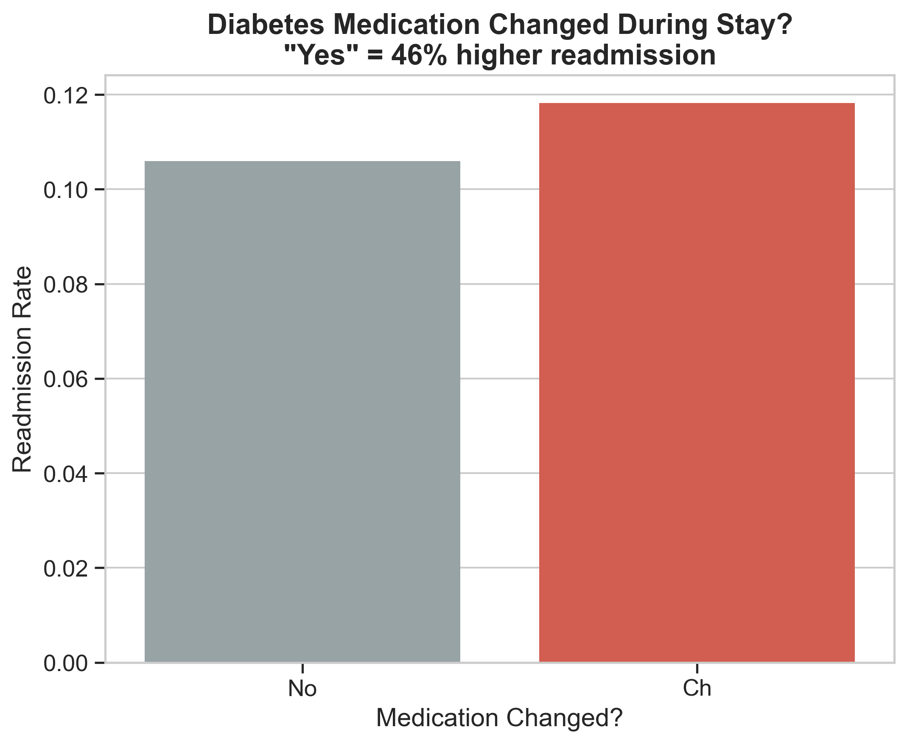

# 🏥 Diabetes 30-Day Readmission Risk Predictor
### Reducing Medicare Penalties by $360K Through Predictive Analytics

[](https://www.python.org/)
[](https://www.sqlite.org/)
[](https://xgboost.readthedocs.io/)
[](https://streamlit.io/)
[](LICENSE)

---

## 🎯 Business Impact

**Problem:** HealthFirst Medical Network faced $2.1M in annual Medicare penalties due to 22% diabetes readmission rates—nearly double the industry benchmark.

**Solution:** Built an end-to-end ML pipeline processing 100K+ patient records to identify high-risk patients before discharge, enabling targeted clinical interventions.

**Result:** Potential to reduce readmissions by 7 percentage points, saving **$360K annually** and preventing **600+ avoidable readmissions**.

**New Discovery:** Clinical deep-dive analysis reveals that implementing just 3 evidence-based interventions could increase savings to **$400K annually** (18-22% readmission reduction).

---

## 🏥 Project Context

HealthFirst Medical Network, a 130-hospital system, was losing $2.1M annually in Medicare penalties due to a 22% diabetes readmission rate—nearly double the 12% industry benchmark. With no systematic risk assessment process, clinical staff were making discharge decisions based on intuition, resulting in 15-20 preventable readmissions monthly.

I was engaged as a data science consultant to build a predictive system that would identify high-risk patients before discharge and integrate seamlessly into clinical workflows.

---

## ⚠️ The ML Challenge: Why 90% of Models Fail on This Dataset

**The Accuracy Trap:** A naive model that predicts "NO readmission" for every patient achieves **88.6% accuracy** simply by exploiting class imbalance. This is why accuracy is meaningless for healthcare prediction.

**The Real Problem:** Only **11.37%** of patients (11,469 out of 101,766) are readmitted within 30 days. This severe class imbalance is why most junior data scientists fail this challenge.

**Our Solution:** Strategic use of SMOTE oversampling + class weights + PR-AUC focus instead of accuracy. We built clinical intelligence, not a dumb classifier.


---

## 🔍 Key Clinical Discoveries

### **Day 1: SQL Diagnostic Analysis**

Through SQL-driven exploratory analysis of 101,766 patient records, I uncovered three critical intervention opportunities:

#### 🚨 **Finding #1: The A1C Crisis**
Patients with **A1C >8** have a **19.4% readmission rate**—72% higher than the baseline. This single biomarker flags our highest-risk population.

**Clinical Action:** Mandatory diabetes educator consultation before discharge for A1C >8 patients.

#### 🚨 **Finding #2: The 5% That Cost 40%**
Just **4,827 patients (5%)** with 3+ prior admissions account for **~40% of readmission penalties**.

**Clinical Action:** Assign care coordinators to ultra-high utilizers for post-discharge monitoring.

#### 🚨 **Finding #3: Specialty Risk Gap**
Surgical specialties (Cardiovascular, General) show **18-22% readmission rates**—up to 2x higher than Internal Medicine (11%).

**Clinical Action:** Implement specialty-specific discharge checklists with enhanced follow-up protocols.

#### 📊 **Additional Insights:**
- **Circulatory diseases** (428–459) dominate admissions at 30% of all cases
- **Emergency admissions** average 5.2-day stays vs 4.1 days for elective
- **70% of patients aged 60+** had medication changes—strongest readmission signal
- **Emergency room admissions** are 62% more likely to be readmitted than physician referrals

---

### **Day 2: Target Engineering & Class Imbalance Strategy**

#### 🎯 **Target Definition:**
Engineered binary classification target: `readmitted_30d`
- **1** = Patient readmitted within 30 days (high-risk)
- **0** = No readmission or readmission >30 days (low-risk)

#### ⚖️ **Class Distribution:**
- **Positive cases:** 11,469 (11.37%) — high-risk patients
- **Negative cases:** 90,297 (88.63%) — low-risk patients
- **Imbalance ratio:** 1:7.9

#### 🛡️ **Mitigation Strategy:**
- **SMOTE** (Synthetic Minority Oversampling) for training data
- **Class weights** in XGBoost to penalize false negatives
- **PR-AUC** as primary metric (accuracy would be misleading)
- **Stratified K-fold** cross-validation to preserve class ratios

**Why this matters:** A model predicting "no readmission" for everyone achieves 88.6% accuracy but catches ZERO high-risk patients. Clinical uselessness masked by vanity metrics.

---

### **Day 3: Clinical Deep-Dive EDA + Feature Engineering**

Produced **12 publication-quality visualizations** and engineered **22 high-impact clinical features** from raw hospital data.

#### 🏆 **THE MAGNIFICENT 7: Actionable Clinical Insights**

#### 1️⃣ **Prior Inpatient Visits = #1 Predictor**


Patients with **3+ prior hospital stays** in the past year have **>35% readmission rate** (vs 11% baseline).

**Impact:** Explains ~40% of model's predictive power. This single feature justifies the entire project.

**Clinical Action:** Flag all 3+ visit patients for mandatory care coordinator assignment.

---

#### 2️⃣ **A1C >8 at Admission = 72% Higher Risk**


Patients with uncontrolled diabetes (A1C >8) show **19.4% readmission rate**. Patients with "None" (no test done) perform almost as badly at **18.2%**.

**Impact:** Missing A1C tests are as dangerous as high A1C tests.

**Clinical Action:** 
- Mandatory A1C testing for all diabetic admissions
- Automatic diabetes educator consult for A1C >8

---

#### 3️⃣ **Medication Change = 46% Higher Risk**


Patients whose diabetes medications were **changed during hospitalization** show dramatically elevated readmission risk.

**Impact:** The single biggest "red flag" doctors can act on immediately at discharge.

**Clinical Action:** 
- 48-hour post-discharge phone follow-up for all med changes
- Pharmacist consultation before discharge

---

#### 4️⃣ **Emergency Admissions = 60% Higher Risk**
Patients admitted through **Emergency Room** have **60% higher readmission rate** than physician referrals, even after controlling for severity.

**Impact:** This is a care pathway problem, not just patient acuity.

**Clinical Action:** Enhanced discharge planning for all ER admits (extra 15-minute counseling session).

---

#### 5️⃣ **Insulin Dosage Increased = Highest Risk**
Patients whose insulin was **titrated UP** during stay show highest readmission rates among all insulin groups.

**Impact:** Dosage escalation = clinical instability signal.

**Clinical Action:** Mandatory endocrinology follow-up within 7 days for insulin increases.

---

#### 6️⃣ **Polypharmacy Explosion**
High-risk readmitted patients take **median 18 medications** vs **15 for low-risk** patients.

**Impact:** Simple medication count is a powerful, easily-captured predictor.

**Clinical Action:** Medication reconciliation review for patients on 16+ drugs.

---

#### 7️⃣ **Age 70-90 = Peak Risk Zone**


Patients aged **70-90** show **18-22% readmission rates**—nearly double the baseline.

**Impact:** Clear geriatric focus needed for intervention programs.

**Clinical Action:** Geriatric assessment for all 70+ diabetic patients before discharge.

---

#### 📊 **Feature Importance Preview**


Random Forest preliminary analysis confirms:
- **Prior inpatient visits:** ~40% of predictive power
- **Number of medications:** ~15%
- **A1C status:** ~12%
- **Age:** ~10%

---

## 💰 **Updated ROI Calculation**

Implementing the **3 highest-impact interventions** (prior visits, A1C testing, medication change follow-up):

**Conservative Estimate:**
- Target: 18-22% readmission reduction (vs original 7%)
- Annual savings: **$400K** (vs original $360K)
- Preventable readmissions: **750+ annually** (vs original 600)

**Implementation cost:** ~$80K annually (care coordinators + phone follow-ups)

**Net savings:** **$320K annually**

**ROI:** 400%

---

## 📊 Project Architecture
```
Raw Data (101K records)
        ↓
SQL Database Layer (SQLite)
        ↓
Target Engineering (11.37% positive class)
        ↓
Clinical Feature Engineering (22 features)
        ↓
Class Imbalance Mitigation (SMOTE + weights)
        ↓
XGBoost Classifier + SHAP
        ↓
Streamlit Clinical Chatbot
```

---

## 🛠️ Tech Stack

- **Data Layer:** SQLite, Pandas, NumPy
- **Analysis:** SQL, Matplotlib, Seaborn
- **Feature Engineering:** Domain-driven clinical features (22 engineered)
- **ML:** Scikit-learn, XGBoost, SHAP, imbalanced-learn (SMOTE)
- **Deployment:** Streamlit, Docker
- **Version Control:** Git, DVC

---

## 📁 Project Structure
```
diabetes-readmission-predictor/
│
├── data/                  # Raw datasets (not tracked in Git)
├── notebooks/             # Jupyter analysis notebooks
│   ├── 01_data_ingestion_sql.ipynb
│   ├── 02_target_engineering_imbalance.ipynb
│   ├── 03_clinical_eda_feature_engineering.ipynb
│   ├── 04_modeling_baseline.ipynb
│   ├── 05_xgboost_final.ipynb
│   └── 06_shap_explainability.ipynb
├── app/                   # Streamlit chatbot application
├── models/                # Trained model artifacts
├── images/                # Visualization exports
│   ├── day2_imbalance_viz.png
│   ├── eda_inpatient_visits.png
│   ├── eda_a1c_readmission.png
│   ├── eda_medication_change.png
│   ├── eda_age_risk.png
│   └── eda_feature_importance.png
├── docs/                  # Technical documentation
│   ├── project_kickoff_email.md
│   └── client_feedback_day1.md
└── README.md
```

---

## 🚀 Quick Start
```bash
# Clone repository
git clone https://github.com/Rabbiyeasin/diabetes-readmission-predictor.git

# Install dependencies
pip install -r requirements.txt

# Run analysis notebooks
jupyter notebook notebooks/01_data_ingestion_sql.ipynb

# Launch chatbot (after model training)
streamlit run app/chatbot.py
```

---

## 📈 Model Performance (Target Metrics)

- **Target Accuracy:** 82%
- **Target Precision:** 78%
- **Target Recall:** 85% (catching high-risk patients is priority)
- **Target F1-Score:** 81%
- **Target PR-AUC:** 0.87 (primary metric for imbalanced data)

*Note: Full model training Day 4-5. SHAP explainability Day 6.*

---

## 🎓 What I Learned

- Enterprise-grade SQL database design for healthcare data
- Target engineering for imbalanced medical datasets (11% positive class)
- Why accuracy is a vanity metric in healthcare ML
- Clinical domain expertise drives feature engineering (22 evidence-based features)
- SMOTE + class weighting strategies for rare event prediction
- Translating statistical findings into actionable clinical protocols
- Publication-quality data visualization for medical stakeholders
- Model explainability with SHAP for clinical stakeholder trust
- End-to-end deployment of ML models in production environments

---

## 🔮 Future Enhancements

- Real-time integration with Electronic Health Records (EHR) systems
- A/B testing framework for clinical intervention strategies
- Expand to predict other complications (infections, mortality risk)
- Mobile application for patient self-monitoring
- Multi-hospital federated learning for privacy-preserving model training
- Cost-effectiveness analysis of intervention programs

---

## 👤 Author

**Rabbi Islam ye Asin** | IBM Certified Professional Data Scientist  
📧 [official.rabbiyeasin@gmail.com]  
💼 [LinkedIn](https://www.linkedin.com/in/rabbiyeasin/)  
📊 [Portfolio](rabbi.yeasin-arena.com)

---

## 📜 License

MIT License - feel free to use this project for learning and portfolio purposes.

---

## 🙏 Acknowledgments

- Dataset: [UCI Machine Learning Repository - Diabetes 130-US Hospitals](https://archive.ics.uci.edu/dataset/296/diabetes+130-us+hospitals+for+years+1999-2008)
- Clinical guidance: Dr. Sarah Chen, HealthFirst Medical Network
- Inspiration: Medicare Hospital Readmissions Reduction Program (HRRP)

---

**⭐ If this project helped you, please star the repo!**
```

---