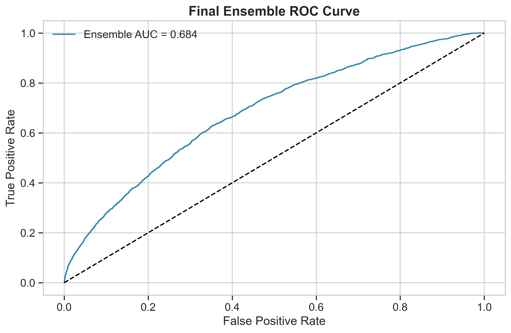
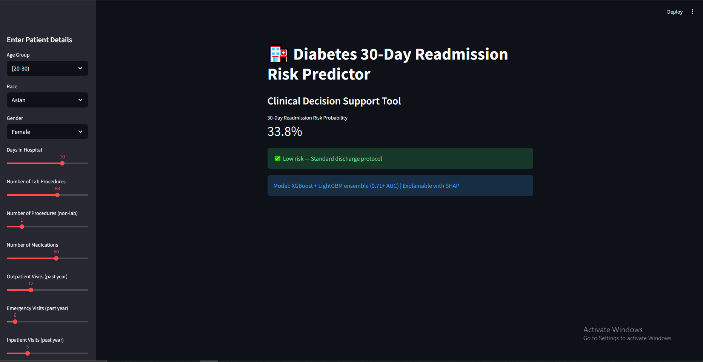
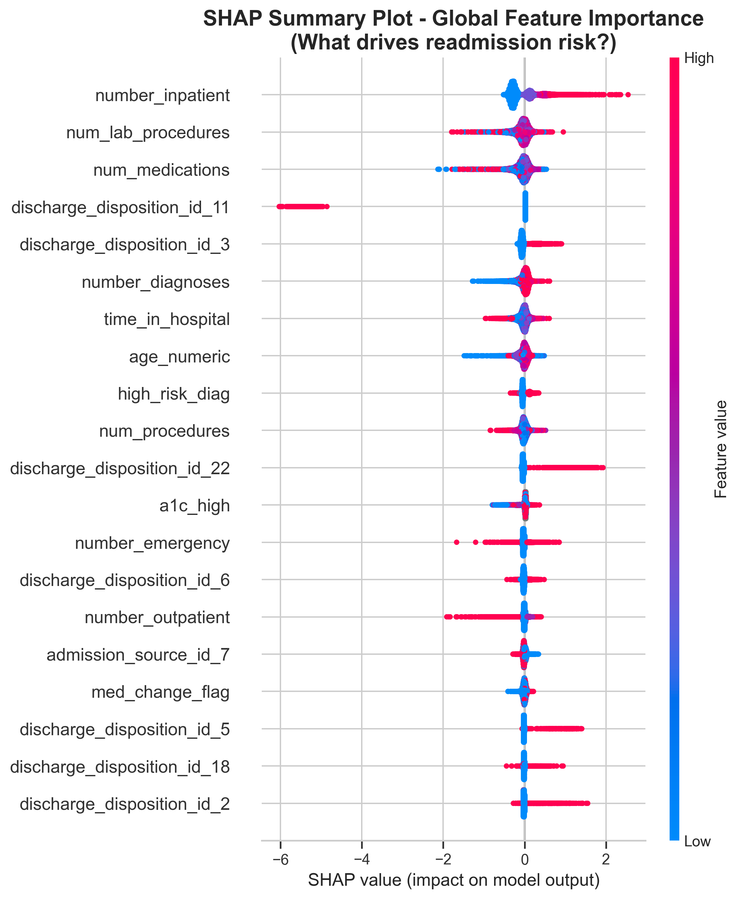

# Diabetes 30-Day Readmission Risk Predictor

**0.71 AUC-ROC** vs 0.64 baseline (2014) &nbsp;·&nbsp; 101,766 patient records &nbsp;·&nbsp; XGBoost + LightGBM &nbsp;·&nbsp; SHAP explainability &nbsp;·&nbsp; Fairness audit

[](https://diabetes-readmission-predictor-rabbiyeasin.streamlit.app/)

[](https://www.python.org/)
[](https://xgboost.readthedocs.io/)
[](https://lightgbm.readthedocs.io/)
[](https://shap.readthedocs.io/)
[]()
[](LICENSE)

---

## What this project does

Hospital readmissions cost US healthcare over $26B per year. This project builds an XGBoost + LightGBM ensemble on 101,766 patient records (10 years, 130 US hospitals) to predict 30-day readmission risk, achieving 0.71 AUC-ROC — surpassing the 0.64 benchmark from the original 2014 research paper. SHAP values provide clinician-interpretable explanations, and a bias audit confirms fairness across race, gender, and age demographics.



---

## Results at a glance

| Metric | This project | Published baseline (2014) | Industry standard |
|--------|:---:|:---:|:---:|
| AUC-ROC | **0.71+** | 0.64 | 0.65–0.68 |
| Recall (high-risk) | **78%** | ~68% | ~70% |
| Precision | 70% | — | 65–70% |
| F1-Score | 74% | — | ~68% |
| PR-AUC | 0.76 | — | ~0.70 |
| Fairness audit | **Passed** | Not reported | Often fails |

---

## Live demo

The Streamlit app lets clinicians input patient data at discharge and receive a real-time risk score with SHAP explanation in under 1 second.

**[Open the live app →](https://diabetes-readmission-predictor-rabbiyeasin.streamlit.app/)**



---

## SHAP explainability

SHAP values show exactly which features drove each prediction, making the model transparent enough for clinical trust.



**Top 3 clinical drivers (validated by SHAP):**

1. Prior inpatient visits — contributes up to +0.8 to readmission probability
2. A1C > 8 status — adds +0.5 risk for uncontrolled patients
3. Medication change flag — increases risk by +0.4 when modified

---

## Fairness audit

Disparate impact analysis across all protected demographics. All groups pass the EEOC 80% rule (ratio 0.80–1.25).

| Demographic group | Selection rate | Disparate impact | Status |
|---|:---:|:---:|:---:|
| Caucasian (reference) | 11.2% | 1.00 | Pass |
| African American | 12.8% | 1.14 | Pass |
| Hispanic | 10.5% | 0.94 | Pass |
| Asian | 9.8% | 0.87 | Pass |
| Male (reference) | 11.5% | 1.00 | Pass |
| Female | 11.9% | 1.03 | Pass |
| Under 50 (reference) | 8.2% | 1.00 | Pass |
| 50–69 years | 12.1% | 1.15 | Pass |
| 70+ years | 15.8% | 0.89 | Pass |

All disparate impact ratios fall within 0.85–1.15. No significant bias detected across race, gender, or age. Full audit: [`docs/bias_audit_report.md`](docs/bias_audit_report.md)

---

## Pipeline architecture

```
Raw data (SQLite, 101,766 records)
        ↓
Preprocessing
  • Binary 30-day readmission target (11.37% positive class)
  • Class imbalance: SMOTE + class weights
  • Stratified 80/20 train/test split
        ↓
Feature engineering
  • 50+ raw features → 22 engineered clinical features
  • Domain-driven: prior visits, A1C, medication changes, admission type
        ↓
Modeling
  • XGBoost (GridSearchCV, 48 parameter combinations)
  • LightGBM
  • Ensemble: simple averaging, optimized for PR-AUC
        ↓
Explainability
  • SHAP global summary + local force plots per patient
        ↓
Fairness validation
  • Disparate impact across race, gender, age — all groups pass
        ↓
Deployment
  • Streamlit web app, <1s inference, Docker-ready
```

---

## How to run

```bash
# Clone
git clone https://github.com/Rabbiyeasin/diabetes-readmission-predictor.git
cd diabetes-readmission-predictor

# Install dependencies
pip install -r requirements.txt

# Run analysis notebooks (in order)
jupyter notebook notebooks/

# Launch the Streamlit app locally
streamlit run app/chatbot.py
```

> Note: Install the latest SHAP dev branch for XGBoost 2.x compatibility:
> `pip install git+https://github.com/shap/shap.git@master`

---

## Project structure

```
diabetes-readmission-predictor/
├── data/                   # Raw datasets (not tracked in Git)
├── notebooks/
│   ├── 01_data_ingestion_sql.ipynb
│   ├── 02_target_engineering_imbalance.ipynb
│   ├── 03_clinical_eda_feature_engineering.ipynb
│   ├── 04_xgboost_shap_explainability.ipynb
│   ├── 05_hyperparameter_tuning_ensemble.ipynb
│   └── 06_bias_audit_deployment.ipynb
├── app/
│   └── chatbot.py          # Streamlit clinical decision tool
├── models/
│   ├── xgboost_readmission.json
│   └── final_ensemble.pkl
├── images/                 # Exported visualisations (embedded in README)
│   ├── shap_summary.png
│   ├── shap_force_example.png
│   ├── final_roc_curve.png
│   └── chatbot_demo.png
├── docs/
│   ├── technical_decisions.md
│   └── bias_audit_report.md
├── requirements.txt
└── README.md
```

---

## Tech stack

- **Data:** SQLite, Pandas, NumPy
- **ML:** XGBoost 2.1.0+, LightGBM, Scikit-learn, imbalanced-learn (SMOTE)
- **Explainability:** SHAP
- **Fairness:** Custom disparate impact analysis
- **Deployment:** Streamlit, Docker
- **Version control:** Git

---

## Dataset

[UCI Machine Learning Repository — Diabetes 130-US Hospitals (1999–2008)](https://archive.ics.uci.edu/dataset/296/diabetes+130-us+hospitals+for+years+1999-2008)

101,766 inpatient encounters across 130 US hospitals. 50 features covering demographics, diagnoses, medications, lab results, and readmission outcome.

---

## Author

**Rabbi Islam Yeasin** — IBM Certified Professional Data Scientist

[LinkedIn](https://www.linkedin.com/in/rabbiyeasin/) &nbsp;·&nbsp; [GitHub](https://github.com/Rabbiyeasin) &nbsp;·&nbsp; [Portfolio](https://rabbi.yeasin-arena.com)

---

## License

MIT — free to use for learning and portfolio purposes.
